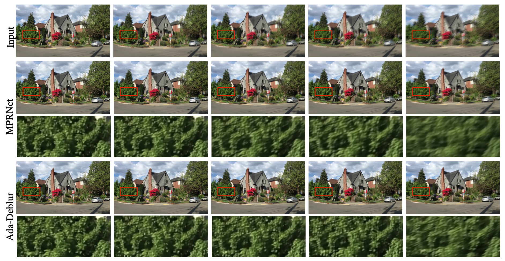
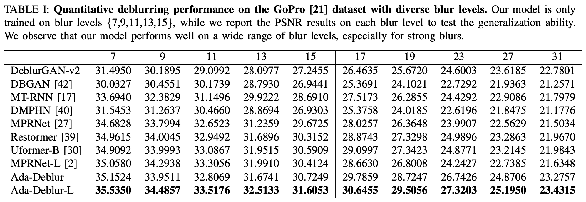
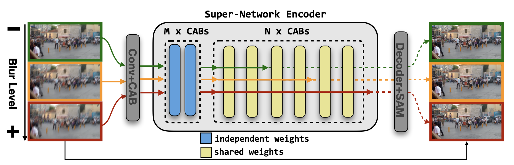

# Broad Spectrum Image Deblurring via An Adaptive Super-Network

[Qiucheng Wu](https://wuqiuche.github.io/)<sup>1</sup>\*,
[Yifan Jiang](https://yifanjiang.net/)<sup>2</sup>\*,
[Junru Wu](http://sandbox3aster.github.io/)<sup>3</sup>\*,
Victor Kulikov<sup>6</sup>,
Vidit Goel<sup>6</sup>,
Nikita Orlov<sup>6</sup>,
[Humphrey Shi](https://www.humphreyshi.com/)<sup>4,5,6</sup>,
[Zhangyang Wang](https://vita-group.github.io/)<sup>2</sup>,
[Shiyu Chang](https://code-terminator.github.io/)<sup>1</sup>
<br>
<sup>1</sup>University of California, Santa Barbara, <sup>2</sup>The University of Texas at Austin, <sup>3</sup>Texas A&M University, <sup>4</sup>UIUC, <sup>5</sup>University of Oregon, <sup>6</sup>Picsart AI Research (PAIR)

\*denotes equal contribution.

This is the official implementation of the paper "Broad Spectrum Image Deblurring via An Adaptive Super-Network".

## Overview

In blurry images, the degree of image blurs may vary drastically due to different factors, such as varying speeds of shaking cameras and moving objects, as well as defects of the camera lens. However, current end-to-end models failed to explicitly take into account such diversity of blurs. This unawareness compromises the specialization at each blur level, yielding sub-optimal deblurred images as well as redundant post-processing. Therefore, how to specialize one model simultaneously at different blur levels, while still ensuring coverage and generalization, becomes an emerging challenge. In this work, we propose Ada-Deblur, a super-network that can be applied to a "broad spectrum" of blur levels with no re-training on novel blurs. To balance between individual blur level specialization and wide-range blur levels coverage, the key idea is to dynamically adapt the network architectures from a single well-trained super-network structure, targeting flexible image processing with different deblurring capacities at test time. Extensive experiments demonstrate that our work outperforms strong baselines on various benchmarks, including both synthetic and realistic blurs. The performance gap between our model and the state-of-the-art becomes more prominent when testing with unseen and strong blur levels. Specifically, our model demonstrates surprising deblurring performance on these images with PSNR improvements of around 2 dB.





## Architecture



## Prerequisite
Please setup the environment as follow:

```bash
conda create -n AdaDeblur python=3.7
conda activate AdaDeblur
conda install pytorch=1.1 torchvision=0.3 cudatoolkit=9.0 -c pytorch
pip install matplotlib scikit-image opencv-python yacs joblib natsort h5py tqdm
cd pytorch-gradual-warmup-lr; python setup.py install; cd ..
```

## Prepare Dataset
First, please download the [GoPro](https://seungjunnah.github.io/Datasets/gopro) (both GoPro_Large and GoPro_Large_all) and the [RealBlur](http://cg.postech.ac.kr/research/realblur/) dataset and unzip them in the `deblurring_release/Datasets` folder. 

Your `Datasets` directory tree should look like this

`Datasets` <br/>
  `└──`train <br/>
    `└──`input <br/>
    `└──`target <br/>
  `└──`test <br/>
    `└──`input <br/>
    `└──`target <br/>
  `├──`GoPro_Large_all <br/>
  `├──`RealBlur-J_ECC_IMCORR_centroid_itensity_ref <br/>
  `├──`RealBlur_J_test_list.txt <br/>
  `├──`RealBlur_R_test_list.txt <br/>
  `└──`RealBlur-R_BM3D_ECC_IMCORR_centroid_itensity_ref

Then, prepare our dataset with diverse blur levels: 
```bash
python genNewGoPro.py
```

This step creates the blurs with different blur levels for training and evaluation. We also provide the data with different blur levels (based on GoPro dataset) [here](https://drive.google.com/file/d/1pJF4bn4Ft64cMMbtzfJFcHKqBYaKfQwb/view?usp=sharing).

## Running Inference
First, please download the pre-trained model weights [here](https://drive.google.com/file/d/16GGqXywetsjDYsjCkNV3AaP4okQJmmGm/view?usp=sharing). Please put it in the ```deblurring_release/pretrained_models``` folder.

To reproduce our results on GoPro dataset:
```bash
cd deblurring_release
python test.py
python calPSNR.py
```

To reproduce our results on RealBlur dataset:
```bash
cd deblurring_release
python test_realblur.py
python calPSNR_realblur.py
```

## Running Training
To start training on GoPro dataset with diverse blur levels:
```bash
cd deblurring_release
python train.py
```

training script will load config under ```deblurring_release/training.yml```.

## Contact

Should you have any question, please contact qiucheng@ucsb.edu

## Parent Repository

This code is adopted from [MPRNet](https://github.com/swz30/MPRNet)</a>.
